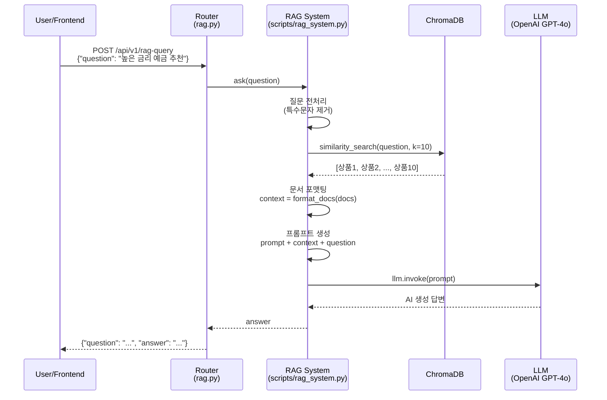
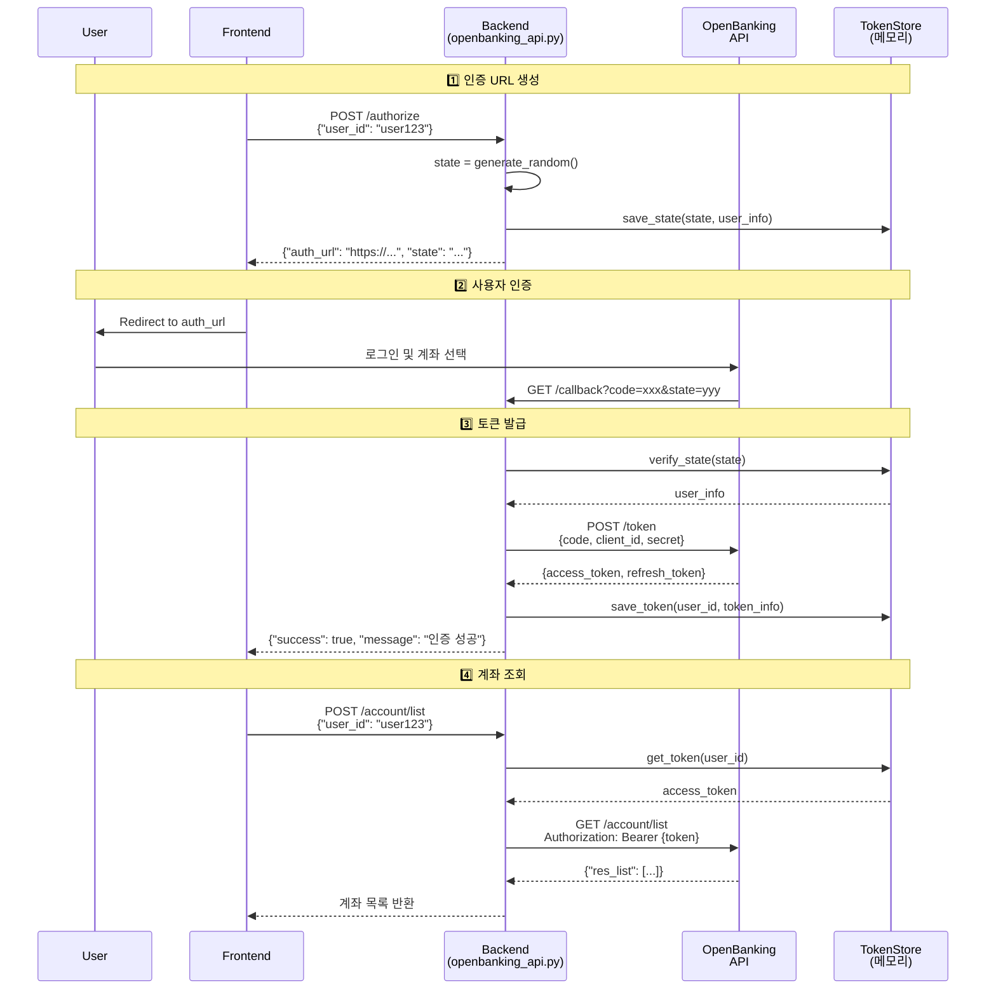
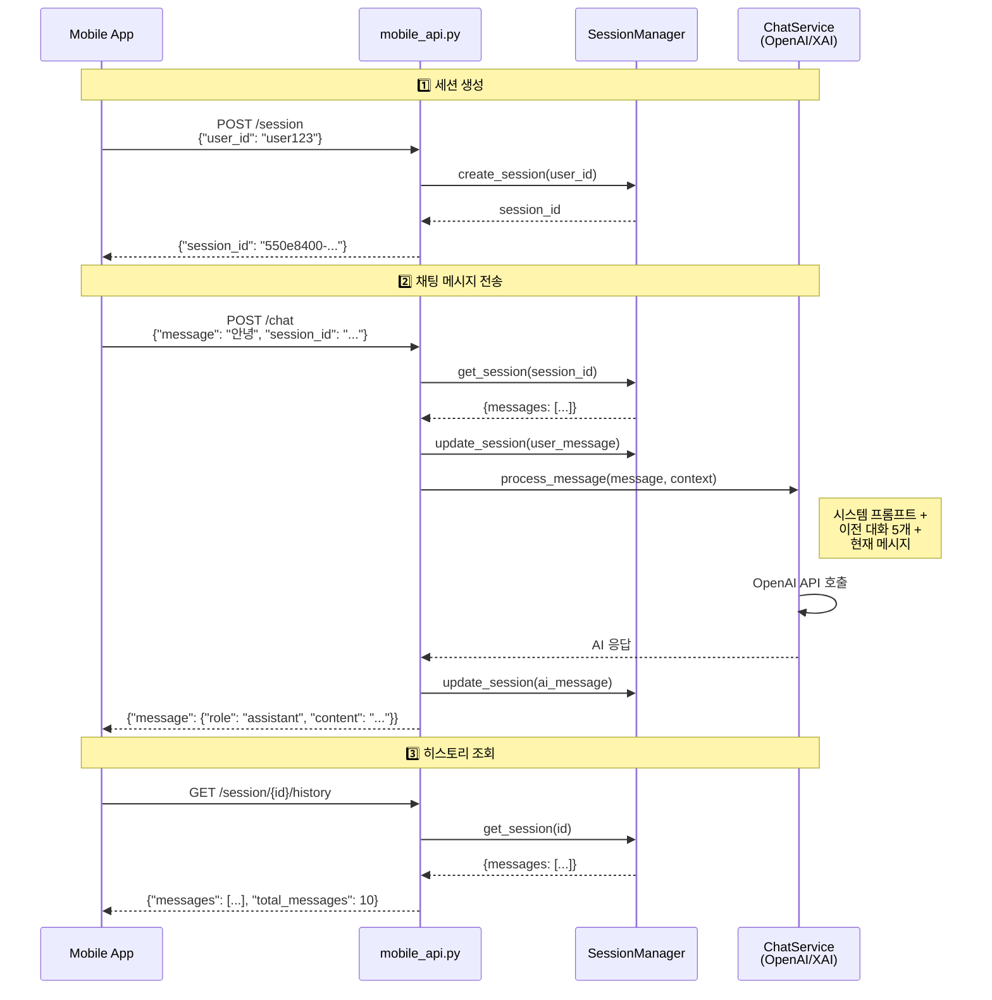
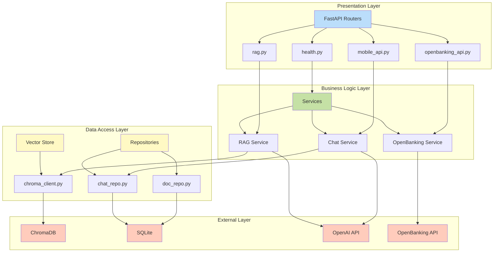
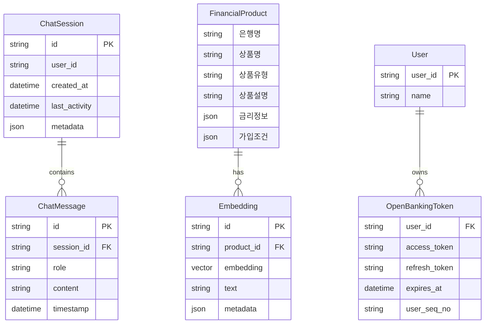
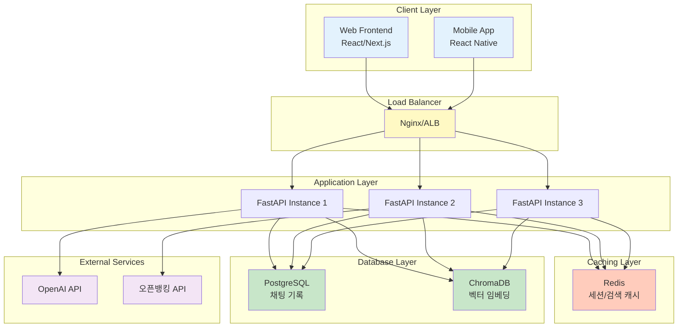

# API Flow Diagrams

## 📊 주요 플로우 다이어그램

---

## 1. RAG 질의응답 플로우



---

## 2. 오픈뱅킹 인증 플로우



---

## 3. 모바일 채팅 플로우



---

## 4. ChromaDB 데이터 삽입 플로우

```mermaid
flowchart TD
    Start([시작: scripts/insert_to_chroma.py]) --> LoadJSON[JSON 파일 로드]

    LoadJSON --> Check{상품목록 키 확인}
    Check -->|있음| Extract1[data = data['상품목록']]
    Check -->|없음| Extract2[data = [data]]

    Extract1 --> Loop[상품별 반복]
    Extract2 --> Loop

    Loop --> Flatten[중첩 딕셔너리<br/>평탄화<br/>flatten_dict]

    Flatten --> Format[텍스트 포맷팅<br/>은행명: ...<br/>상품명: ...<br/>금리: ...]

    Format --> Batch{배치 크기<br/>50개?}
    Batch -->|아니오| Continue[batch.append]
    Batch -->|예| Insert[ChromaDB.add_texts<br/>배치 삽입]

    Continue --> Loop
    Insert --> Loop

    Loop --> Final[남은 데이터 삽입]
    Final --> Complete([완료])

    style Start fill:#e1f5fe
    style Complete fill:#c8e6c9
    style Insert fill:#fff9c4
    style Flatten fill:#f3e5f5
```

---

## 5. 시스템 레이어 아키텍처



---

## 6. 에러 처리 플로우

```mermaid
flowchart TD
    Request[HTTP Request] --> Router[Router]

    Router --> Try{Try Block}

    Try -->|성공| Response[Success Response<br/>200 OK]

    Try -->|ValidationError| VE[Pydantic 검증 오류]
    Try -->|HTTPException| HE[HTTP 예외]
    Try -->|APIException| AE[커스텀 API 예외]
    Try -->|Exception| GE[일반 예외]

    VE --> Handler1[validation_exception_handler]
    HE --> Handler2[http_exception_handler]
    AE --> Handler3[api_exception_handler]
    GE --> Handler4[general_exception_handler]

    Handler1 --> Error1[422 VALIDATION_ERROR]
    Handler2 --> Error2[4xx/5xx HTTP_XXX]
    Handler3 --> Error3[Custom Error Code]
    Handler4 --> Error4[500 INTERNAL_ERROR]

    Error1 --> Log[로깅]
    Error2 --> Log
    Error3 --> Log
    Error4 --> Log

    Log --> Return[JSON Error Response<br/>{success: false, error: {...}}]

    style Request fill:#e1f5fe
    style Response fill:#c8e6c9
    style Return fill:#ffcdd2
    style Log fill:#fff9c4
```

---

## 7. 데이터 모델 관계도



---

## 8. 배포 아키텍처 (예정)



---

## 참고 자료

- [FastAPI 공식 문서](https://fastapi.tiangolo.com/)
- [LangChain 문서](https://python.langchain.com/)
- [ChromaDB 문서](https://docs.trychroma.com/)
- [오픈뱅킹 API 명세](https://openbanking.or.kr/)

**작성일**: 2025-01-19
